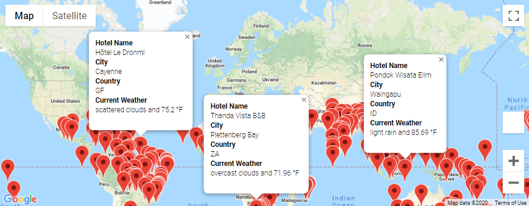
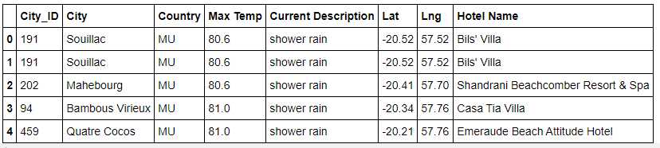
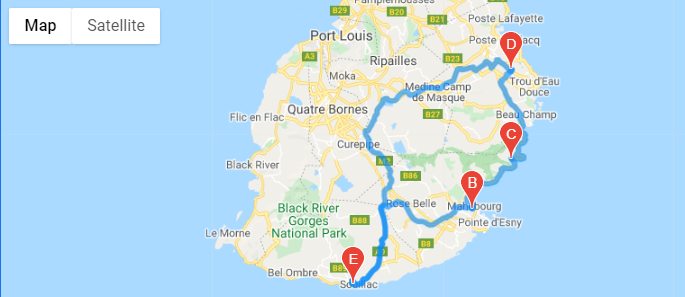
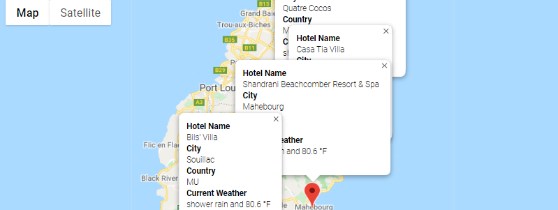
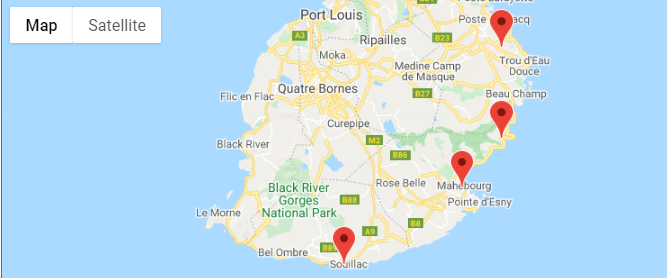

# World Weather Analysis

## Overview of Project:

Using python code, pandas and API's to perform an analysis of world vacation options based on weather, particularly temperature range.  

### Purpose:

Python code and pandas are used to perform an analysis of vacation options around the world based on user input minimum and maximum temperature range.  Using application programming interfaces (APIs), city locations (based on latitude and longitude coordinates) and nearest hotels  to the city locations were retrieved.

## Analysis Results and Challenges:

### Analysis of Outcomes 
To begin the analysis, a set of 2000 random latitudes and longitudes were generated to retrieve the nearest city using an API call with the OpenWeatherMap.  This retrieved 704 cities.

Based on that city list, input statements were created to retrieve potential travel destinations and nearby hotels based on the specified customer weather temperature range.  Based on a temperature range of 70-90°F, the following travel destinations were found.

#### Vacation Map

From the vacation map, the island of Mauritius was chosen as the preferred travel destination.  Four cities where chosen to visit on vacation.  The Google Maps based driving route, map with pop-up markers for additional information, and map designating the four cities (with no additional pop-ups) were generated.

#### Mauritius Travel Itinerary

#### Mauritius Vacation Driving Route

    

#### Mauritius Vacation Map with Pop-up Markers

#### Mauritius Vacation Map without Pop-up Markers

### Challenges and Difficulties Encountered
During the vacation search, the findings were cleansed to remove any empty rows.  It was found that some destinations did not contain a country code and needed to be dropped from the results list.  In performing that activity, a Jupyter Notebook warning message was displayed even though the rows were successfully dropped (based on comparing total beginning and after row counts).  The analysis proceeded without refactoring the code that produced the warning message as another results cleansing activity would be performed that would further remove results (e.g. additional rows) that did not contain hotel references. This cleaning activity did not produce any warning messages so the analysis was completed without re-factoring code.
